<p align="center">
  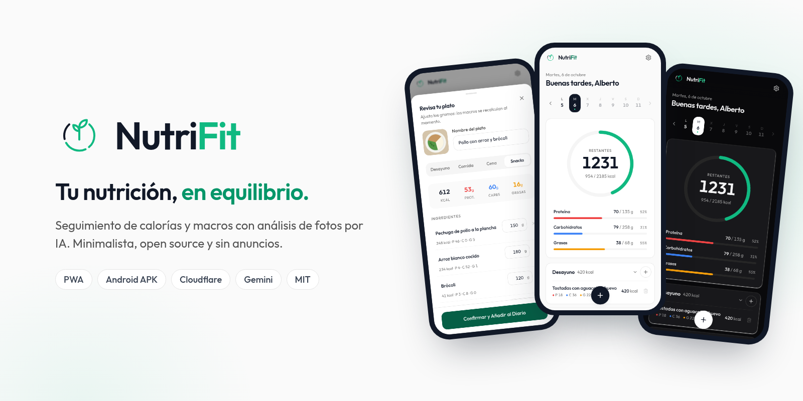
</p>

<p align="center">
  <strong>Seguimiento de calorías y macros con análisis de fotos por IA. Minimalista, open source y sin anuncios.</strong><br/>
  <em>Minimalist, open-source calorie &amp; macro tracker with AI meal-photo analysis (Spanish UI).</em>
</p>

<p align="center">
  <a href="https://nutri.trujillomingorance.com"><b>nutri.trujillomingorance.com</b></a> ·
  <a href="https://nutri.trujillomingorance.com/descargar">Descargar</a> ·
  <a href="https://github.com/ATM-Software-Labs/nutrifit/releases/latest">Releases</a> ·
  <a href="LICENSE">Licencia MIT</a>
</p>

<p align="center">
  
  
  
  
</p>

---

## Capturas

| Escritorio · Panel | Escritorio · Historial | Escritorio · Entrar con QR |
|:-:|:-:|:-:|
| 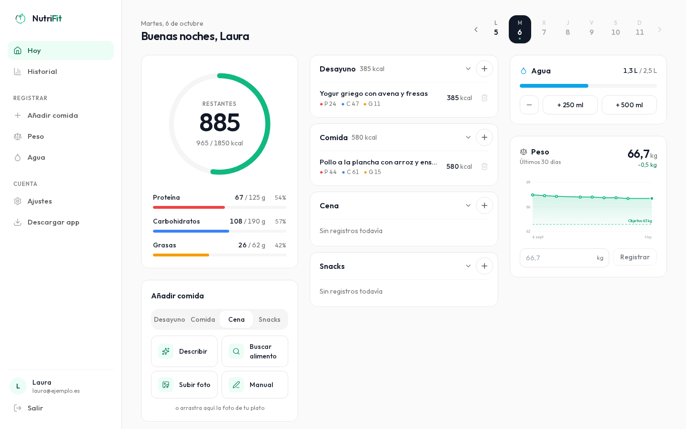 | 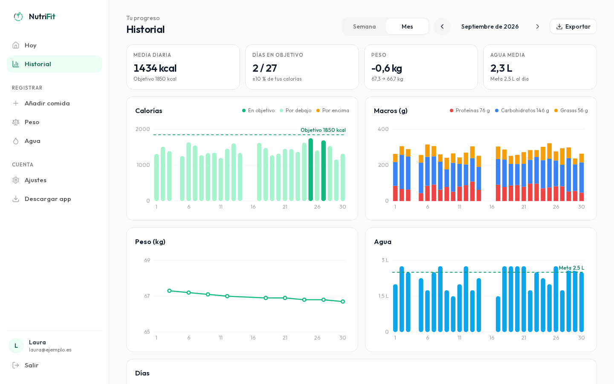 | 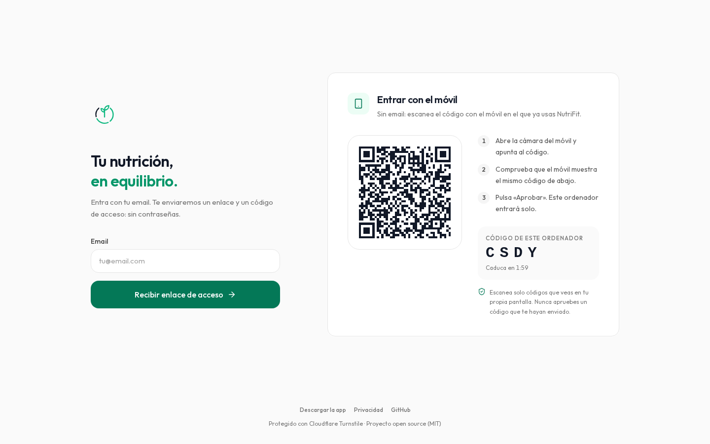 |

| Inicio | Plan diario | Panel | Modo oscuro |
|:-:|:-:|:-:|:-:|
| 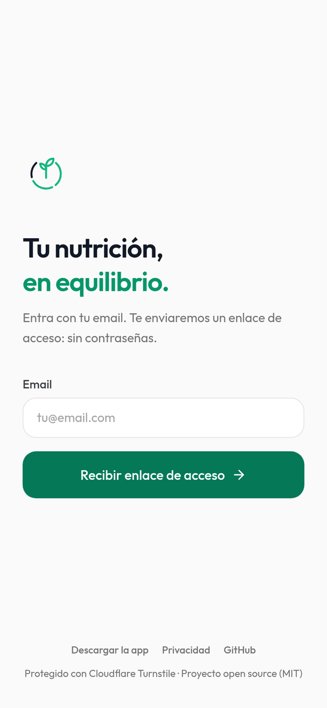 | 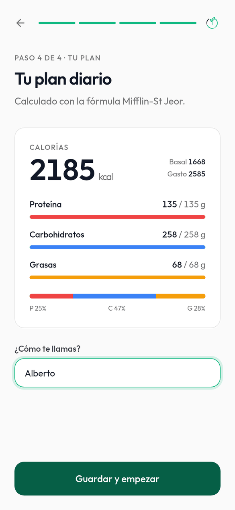 | 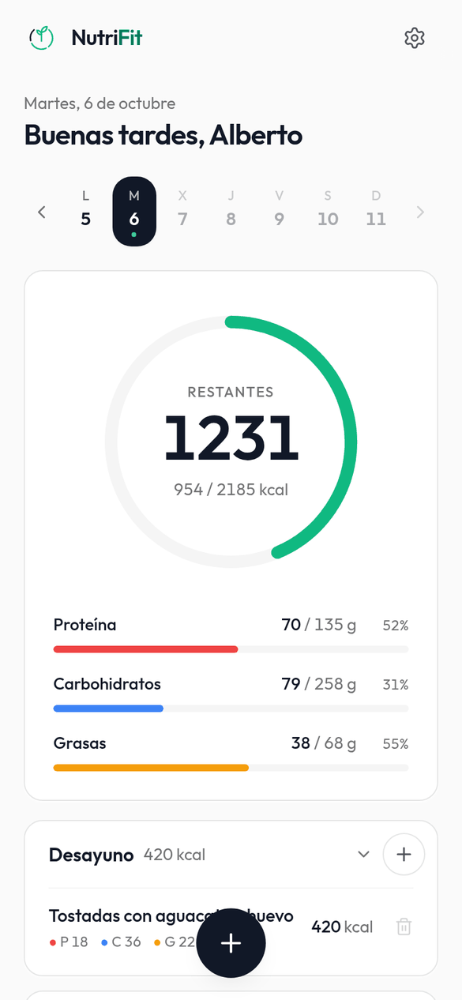 | 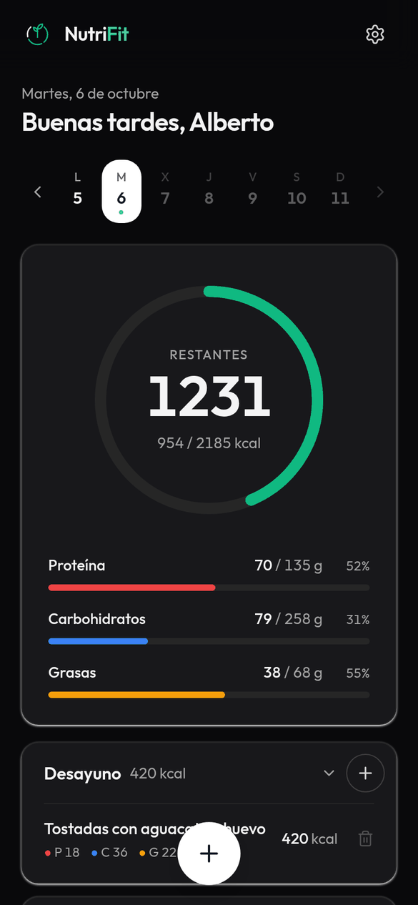 |
| **Revisión del plato (IA)** | **Peso** | **Descarga Android** | **Instalar en iPhone** |
| 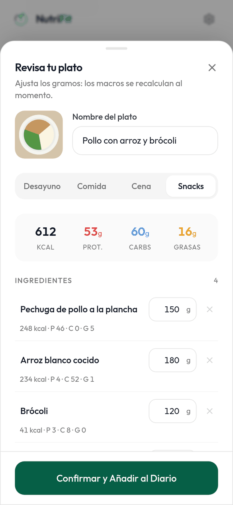 | 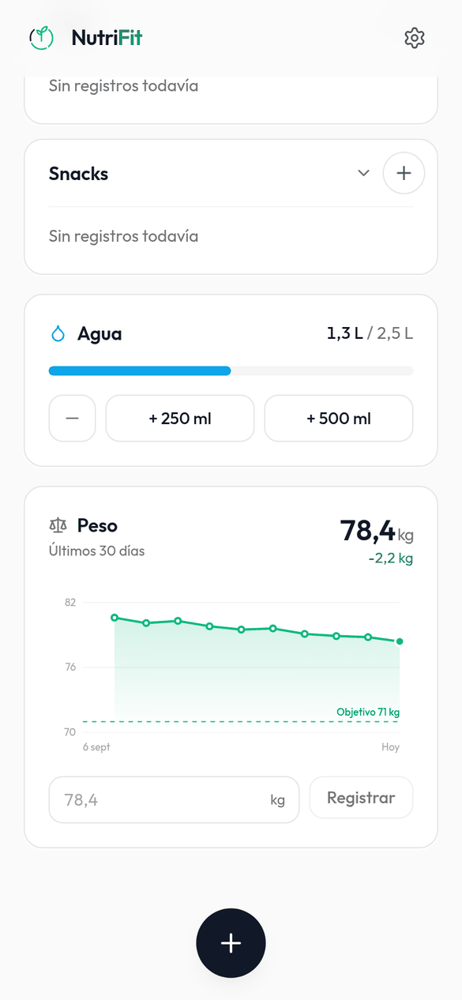 | 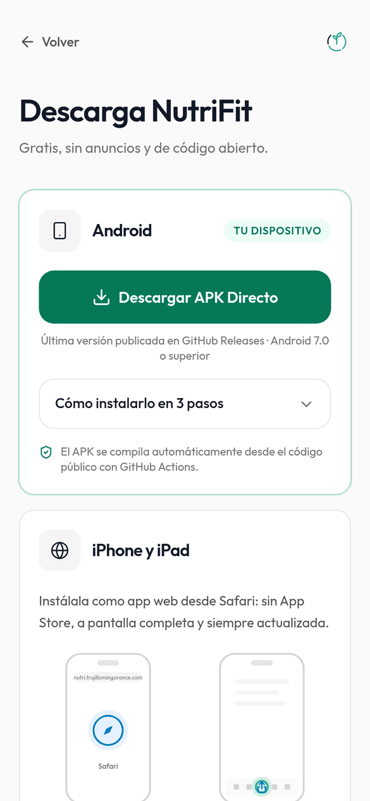 | 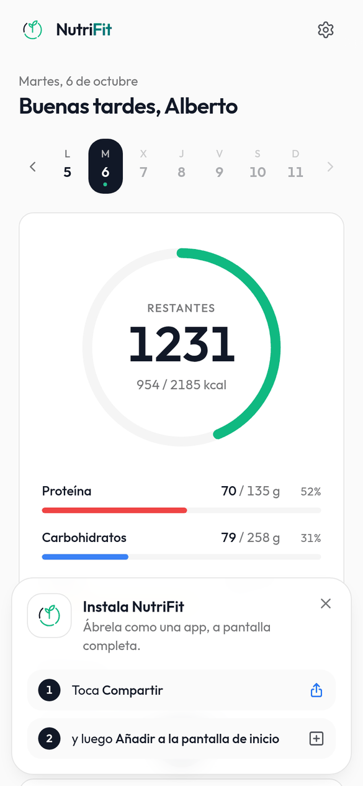 |

## Funciones

- **Entrar sin contraseña:** enlace mágico **y código de 6 cifras** en el mismo email (15 min, un solo uso, 5 intentos), protegido con Cloudflare Turnstile invisible.
- **Entrar en el PC con un QR:** el ordenador muestra un QR y un código corto; lo escaneas con el móvil donde ya tienes sesión, compruebas el código y pulsas «Aprobar» (2 min, un solo uso, ligado a ese navegador).
- **Plan personalizado:** onboarding en 4 pasos con Mifflin-St Jeor, nivel de actividad y objetivo (perder grasa, mantener, ganar músculo).
- **Foto → macros:** la foto se comprime en el móvil (800 px, WebP) y la analiza **Gemini**, con **Workers AI (Llama 3.2 Vision)** de respaldo. Revisas ingredientes y gramos y los macros se recalculan al momento.
- **Sin cámara:** describe la comida con texto («dos huevos revueltos y una tostada») y la IA estima los macros (Gemini o, si no hay clave, Workers AI); **sube una foto** desde el PC (selector o arrastrar y soltar); o **busca alimentos** en una base local de ~360 alimentos habituales en España (valores por 100 g de [USDA FoodData Central](https://fdc.nal.usda.gov/), dominio público) y en **Open Food Facts** por nombre o código de barras.
- **Escritorio:** a partir de 1024 px, barra lateral (Hoy, Historial, Añadir comida, Peso, Agua, Ajustes, Descargar app) y panel en 2–3 columnas con «Añadir comida» siempre a mano. En el móvil todo sigue igual.
- **Historial:** vista semanal o mensual con calorías frente al objetivo, macros P/C/G, tendencia de peso y agua (SVG ligero) y la lista de días con sus totales.
- **Exportar:** CSV de comidas, peso o agua (rango de fechas, formato español para Excel) e **informe PDF** imprimible.
- **Diario:** anillo de calorías restantes, barras de proteína/carbohidratos/grasas, desayuno, comida, cena y snacks; altas y bajas instantáneas (optimistas).
- **Agua y peso:** objetivo de 2,5 L y gráfica de 30 días con línea de objetivo.
- **Instalable:** PWA para iPhone/iPad (funciona sin conexión) y **APK Android** compilado por GitHub Actions.
- **Accesible y ligera:** modo claro/oscuro, foco visible, `prefers-reduced-motion`, Lighthouse móvil 98–100 y ~55 KB de JS inicial (gzip); el resto (historial, búsqueda, QR, informe…) se carga bajo demanda.

## Stack

| Capa | Tecnología |
|---|---|
| Frontend | Vite · React 18 · TypeScript · Tailwind CSS · lucide-react · Service Worker propio |
| Hosting | **Cloudflare Pages** (estáticos + cabeceras de seguridad) |
| API | **Cloudflare Pages Functions** (`functions/`) con Zod |
| Base de datos | **Cloudflare D1** (SQLite) |
| IA | **Google Gemini** (principal) · **Cloudflare Workers AI** (respaldo) |
| Anti-bots | **Cloudflare Turnstile** (modo invisible) |
| Email | **Brevo** (API transaccional) |
| Móvil | **PWA** (iPhone/iPad) · **Capacitor 8** (APK Android) |
| CI | GitHub Actions (APK firmado → GitHub Releases) |

## Arquitectura

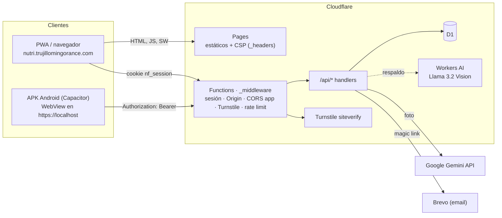

Más detalle: [docs/BACKEND.md](docs/BACKEND.md) · [docs/FRONTEND.md](docs/FRONTEND.md) · [docs/ANDROID.md](docs/ANDROID.md).

## Seguridad (resumen)

- **Sesiones:** cookie `nf_session` firmada con HMAC-SHA256 (`HttpOnly; Secure; SameSite=Strict`, 30 días). En la app, token **Bearer** de 60 días con una clave derivada distinta y **revocable** (tabla `tokens_app`).
- **Magic links:** firmados, 15 minutos, un solo uso (consumo atómico en D1, solo se guarda el hash). La respuesta es la misma exista o no el email (sin enumeración de usuarios).
- **CSRF:** comprobación de `Origin` + `SameSite=Strict` + Content-Type JSON/multipart. Las peticiones con Bearer no llevan credenciales automáticas, así que no aplica.
- **CORS** solo para el WebView de la app (`https://localhost`, `capacitor://localhost`), sin credenciales.
- **Turnstile** en las rutas anónimas o caras (pedir enlace, guardar perfil, analizar foto).
- **Rate limiting** en D1: 5 enlaces/15 min por IP y por email, 20 análisis/min por IP y 10 análisis/día por usuario.
- **Validación** con Zod (rangos fisiológicos, sin HTML) y SQL siempre con `prepare().bind()`.
- **Cabeceras:** CSP estricta (sin `unsafe-inline`), HSTS, `X-Frame-Options: DENY`, `nosniff`, Permissions-Policy, COOP.
- **IA:** las fotos no se guardan. Mira la [política de privacidad](PRIVACIDAD.md) (borrador) por el uso de datos del nivel gratuito de Gemini.

## Desarrollo local

Requisitos: **Node.js ≥ 22**. Para el APK, además JDK 21 y Android SDK.

```bash
git clone https://github.com/ATM-Software-Labs/nutrifit.git && cd nutrifit
npm install
cp .dev.vars.example .dev.vars        # claves de PRUEBA de Turnstile + AUTH_SECRET local
npm run db:migrate:local              # crea la BD D1 local
npm run build && npm run pages:dev:offline   # http://localhost:8788 (sin cuenta de Cloudflare)
```

| Comando | Qué hace |
|---|---|
| `npm run dev` | Vite en :5173 (proxy de `/api` a :8788) |
| `npm run pages:dev` | build + Functions con Wrangler (requiere `wrangler login` por Workers AI) |
| `npm run pages:dev:offline` | igual, sin cuenta (el análisis de fotos responde 503 si no hay `GEMINI_API_KEY`) |
| `npm run typecheck` / `npm test` | tipos (app + Functions + tests) / tests unitarios |
| `npm run android:debug` | build web + `cap sync` + `assembleDebug` |

Sin `BREVO_API_KEY`, el enlace mágico se imprime en la consola de Wrangler.

## Desplegar en tu propio subdominio

Necesitas una cuenta de Cloudflare con tu dominio, Node 22 y `npx wrangler login`.

1. **Proyecto de Pages:** `npx wrangler pages project create nutrifit --production-branch main`.
2. **D1:** `npx wrangler d1 create nutrifit-db` → copia el `database_id` en `wrangler.toml`, luego
   `npm run db:migrate:remote` (aplica `migrations/0001…` y `0002…`).
3. **Variables** en `wrangler.toml`: `APP_URL` (tu URL), `ALLOWED_ORIGINS` (tu dominio y `*.pages.dev`), `TURNSTILE_SITE_KEY`.
4. **Turnstile:** Cloudflare → Turnstile → *Add widget*, modo **Invisible**, hostnames: tu dominio, `<proyecto>.pages.dev` y `localhost` (para el WebView del APK).
5. **Secretos:**
   ```bash
   npx wrangler pages secret put AUTH_SECRET --project-name nutrifit           # ≥ 32 caracteres aleatorios
   npx wrangler pages secret put TURNSTILE_SECRET_KEY --project-name nutrifit
   npx wrangler pages secret put BREVO_API_KEY --project-name nutrifit
   npx wrangler pages secret put GEMINI_API_KEY --project-name nutrifit        # Google AI Studio
   ```
6. **Brevo:** autentica tu dominio (SPF, DKIM, DMARC) y ajusta el remitente en `functions/utils/brevo.ts`.
7. **Workers AI:** acepta una vez la licencia de Llama 3.2 Vision (ver [docs/BACKEND.md §5](docs/BACKEND.md)).
8. **Desplegar:** `npm run deploy`.
9. **Dominio propio:** Pages → *Custom domains* → `nutri.tudominio.com` (CNAME a `<proyecto>.pages.dev`, SSL *Full (strict)*).
10. **APK con tu dominio:** cambia `VITE_API_URL` / `VITE_GITHUB_REPO` (o `src/lib/config.ts`), el host del intent-filter en `android/app/src/main/AndroidManifest.xml` y el `appId` en `capacitor.config.ts`.

Guía paso a paso con git y GitHub: [docs/SETUP-git-y-despliegue.md](docs/SETUP-git-y-despliegue.md). Antes de abrirlo al público: [docs/CHECKLIST-LANZAMIENTO.md](docs/CHECKLIST-LANZAMIENTO.md).

## APK Android

- **Descarga directa:** <https://github.com/ATM-Software-Labs/nutrifit/releases/latest/download/NutriFit.apk>.
- **CI:** `.github/workflows/compilar-apk.yml` se ejecuta al publicar un tag `v*` (o a mano).
  - Compila la web, sincroniza Capacitor y genera el APK.
  - Si están los secretos `ANDROID_KEYSTORE_BASE64`, `ANDROID_KEYSTORE_PASSWORD`, `ANDROID_KEY_ALIAS` y `ANDROID_KEY_PASSWORD`, lo firma en release; si no, publica uno de depuración.
  - Sube `NutriFit-vX.Y.Z.apk` y `NutriFit.apk` a la Release.
- **Firma:** `bash scripts/crear-keystore.sh` crea el keystore e imprime los secretos y la huella SHA-256 para `public/.well-known/assetlinks.json` (App Links). Detalles en [docs/ANDROID.md](docs/ANDROID.md).

## Estructura

```
src/                 app React (components/, hooks/, lib/)
functions/           Pages Functions: _middleware.ts, api/, utils/
migrations/          esquema D1
public/              estáticos: logo, iconos, manifest, sw.js, _headers, app-login, .well-known/
android/             proyecto nativo Capacitor (versionado)
resources/           icono y splash de origen para Capacitor
scripts/             marca, servidor local sin cuenta, keystore
tests/               tests unitarios (node --test)
docs/                guías, banner y capturas
.github/workflows/   compilar-apk.yml
```

## Contribuir

1. Abre un *issue* para hablar del cambio.
2. Crea una rama desde `main`.
3. Antes del PR, ejecuta `npm run typecheck && npm test && npm run build`.

Textos de la interfaz y comentarios en español. No subas secretos: `.dev.vars`, `*.jks` y `.env*` están en `.gitignore`. Si encuentras una vulnerabilidad, escribe a soporte@trujillomingorance.com en lugar de abrir un issue público.

## Licencia

[MIT](LICENSE) © 2026 Alberto Trujillo Mingorance. Fuente Outfit bajo [SIL OFL 1.1](public/fonts/OFL.txt).
